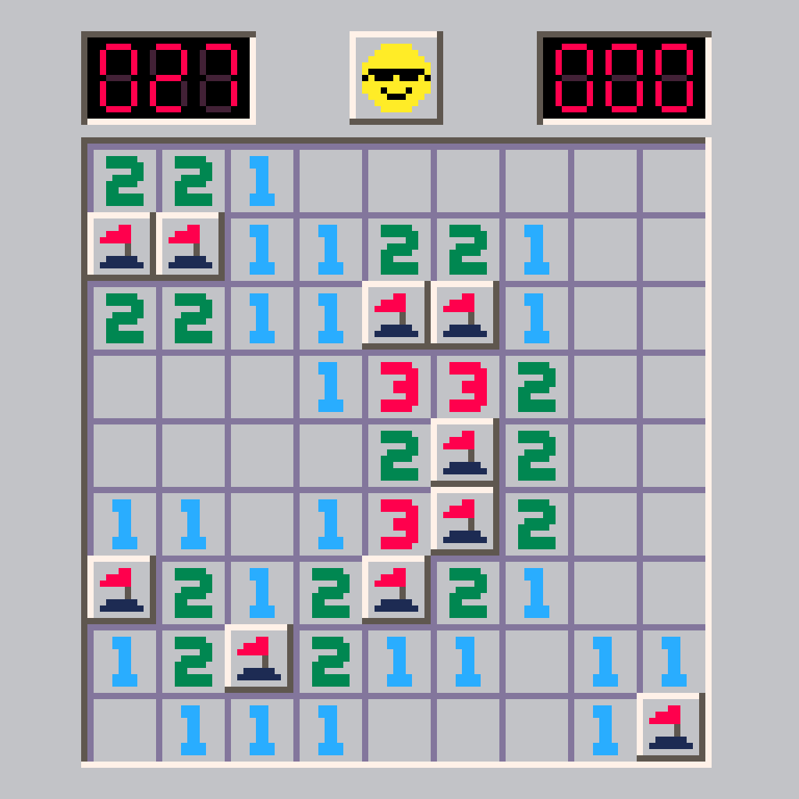

# pico minesweeper

A simple pico-8 game example.



...with the following features:

- Mouse support
- Custom Palette
- Custom menu items
  - Change difficulty from menu

TODO:

- Keyboard/gamepad support
- Save/Load
- Sound & music

## Code comments

### Difficulties

- Difficulty 0 - Easy: 10 mines
- Difficulty 1 - Hard: 18 mines

### board data (board_t)

- -1 mine
- 0 blank
- n nearby mines

### board status (status_t)

- 0 closed
- 1 flag
- 2 question mark
- 3 wrong flag
- 4 down
- 5 open
- 6 explode
- 7 show mine

### game status (g_status)

- 0 ready
- 1 gaming
- 2 win
- 3 lose

### Seven-segment display index

```text

  ┌─────┐
  └──1──┘
┌─┐     ┌─┐
│ 2     3 │
└─┘     └─┘
  ┌─────┐
  └──4──┘
┌─┐     ┌─┐
│ 5     6 │
└─┘     └─┘
  ┌──7──┐
  └─────┘
```
